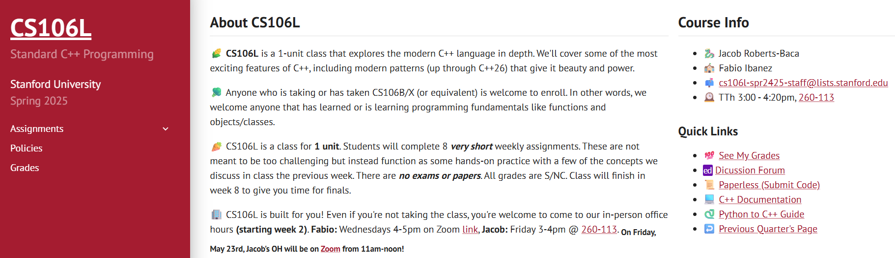

## CS106L

🥕 CS106L是一门1学分的课程。学生需完成**8次**非常简短的每周作业。这些作业设计初衷并非刻意挑战难度，而是作为实践环节，帮助巩固前一周课堂讨论的部分概念。本课程不设考试或论文，所有成绩均以合格/不合格（S/NC）评定。

🥦 凡正在修读或已修完CS106B/X课程（或同等课程）的学生均可报名。换言之，只要您已掌握或正在学习函数、对象/类等编程基础内容，我们都诚邀您加入。

## 进度

### assignment0

总结：第一个作业就是配置C++开发环境，主要是安装C++的编译器gcc，版本控制工具Git和用于执行autograder的Python（3.8及以上）。后面两个很好解决，因为之前就已经安装过了，麻烦的是编译器，而mac上默认的编译器是clang，因为网络问题，下载gcc时很慢，而且中间还失败了几次，在不断坚持下，最后一次终于成功了。

