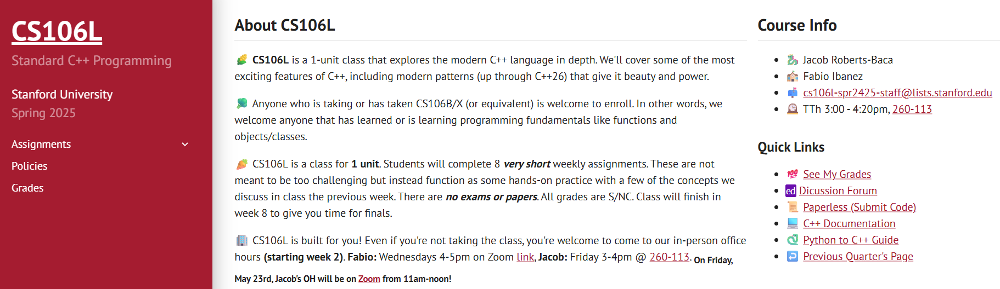

## CS106L



🌽 CS106L 是一门 1 学分的课程，深入探讨现代 C++ 语言。我们将涵盖 C++ 中最令人兴奋的特性（包括直至 C++26 的前沿现代编程范式），这些特性赋予了 C++ 美感与强大功能

🥕 学生需完成 **8次** 非常简短的每周作业。这些作业设计初衷并非刻意挑战难度，而是作为实践环节，帮助巩固前一周课堂讨论的部分概念。本课程不设考试或论文，所有成绩均以合格/不合格（S/NC）评定。

🥦 凡正在修读或已修完CS106B/X课程（或同等课程）的学生均可报名。换言之，只要您已掌握或正在学习函数、对象/类等编程基础内容，我们都诚邀您加入。


## 索引表

| 序号 |             章节              |                            代码                            |                             读本                             |                        笔记                         |
| :--: | :---------------------------: | :--------------------------------------------------------: | :----------------------------------------------------------: | :-------------------------------------------------: |
|  01  |            Welcome            |                            N/A                             |                             N/A                              |                         N/A                         |
|  02  |       Types and Structs       |       <a href="02 - Types and Structs/Code">Code</a>       | <a href="https://cs106l.github.io/textbook/cpp-fundamentals/types-and-structs">Reader</a> | <a href="notes/类型和结构体.md">类型和结构体.md</a> |
|  03  | Initialization and References | <a href="03 - Initialization and References/Code">Code</a> | <a href="https://cs106l.github.io/textbook/cpp-fundamentals/initialization-and-references#how-to-initialize-objects">Reader</a> | <a href="notes/初始化与引用.md">初始化与引用.md</a> |
|  04  |         Guest Lecture         |                            N/A                             |                             N/A                              |                         N/A                         |
|  05  |            Streams            |            <a href="05 - Streams/Code">Code</a>            |                             N/A                              |           <a href="notes/流.md">流.md</a>           |
|  06  |          Containers           |                            N/A                             | [Reader](https://cs106l.github.io/textbook/containers/sequence-containers) |         <a href="notes/容器.md">容器.md</a>         |

> **注**：官方开源了部分年份（如2020）的课程录像，可自行在 B站 检索

## 构建方式

大部分文件夹包含若干 C++ 代码文件，位于各章节目录下，建议深入研读。每个代码文件均可编译为对应的可执行文件。请使用 CMake 构建这些可执行文件，以下一组命令应能完成所有可执行文件的构建：

```cmake
$ mkdir build
$ cd build
$ cmake ..      // 调用CMake工具，去上级目录寻找CMakeLists.txt文件
$ make -j8      // 调用Make工具来执行编译，-j表示并行，8表示最多使用8个CPU核心 
```

执行这些命令后，生成的可执行文件将位于 `build` 目录中。

> ⚠️ 重要提示：项目中包含的部分代码示例在编译时会出现预期的错误，此设计是为了教学演示目的而特意保留的


## 作业进度

### assignment0 - Setup


总结：第一个作业就是配置 C++ 开发环境，主要是安装 C++ 的编译器 gcc ，版本控制工具 Git 和用于运行 autograder 的 Python （3.8及以上）。后面两个很好解决，因为之前就已经安装过了，麻烦的是编译器，而 mac 上默认的编译器是 clang ，因为网络问题，下载 gcc 时很慢，而且中间还失败了几次，但在不断坚持下，最后一次终于成功了。


## 版权说明

斯坦福大学的原始材料（slides、lecture code 等资料）保持其原有版权，本人所贡献的部分（notes、作业解答等内容）采取开放式协议，详见 <a href="LICENSE">许可证</a>

