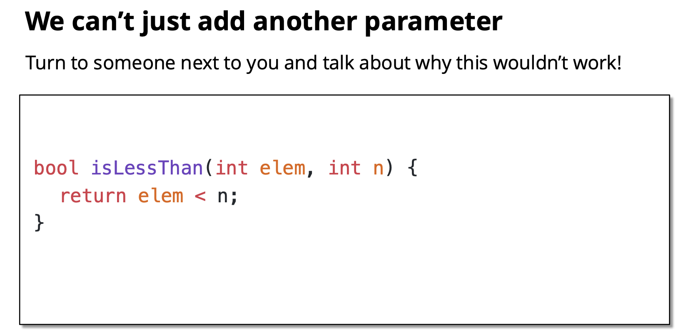

在C++中，“不能添加另一个参数”通常是针对特定场景的设计限制，结合文章上下文，这一表述很可能出现在讨论**如何通过谓词（Predicate）实现通用条件查找**的部分，尤其是在解释为什么传统`find`函数无法直接满足复杂查找需求时。以下是具体原因：

---

### 1. **函数指针的局限性**
如果只是在`find`函数中简单添加一个参数（比如函数指针），虽然可以实现条件查找，但会带来以下问题：
- **类型固定**：函数指针的参数类型必须明确指定，例如：
  
  ```cpp
  template <typename It>
  It find(It first, It last, bool (*pred)(typename It::value_type));
  ```
  这种写法要求谓词函数的参数类型必须与迭代器的值类型完全匹配，无法处理不同类型的条件（比如查找“大于某个值”或“满足自定义规则”的元素）。
- **无法携带状态**：函数指针无法捕获外部变量，例如：
  
  ```cpp
  int threshold = 10;
  auto it = find(v.begin(), v.end(), [threshold](int x) { return x > threshold; });
  ```
  这种情况下，简单添加函数指针参数无法实现带状态的条件判断。

---

### 2. **泛型编程的需求**
C++的模板设计目标是**支持任意类型和灵活的条件**，而简单添加参数会破坏这种泛型性：
- **类型推导失败**：如果添加一个具体类型的参数（比如`int value`），模板函数就只能处理该类型的数据，失去了通用性。
- **条件逻辑耦合**：将条件硬编码为参数会导致函数与特定条件耦合，无法应对变化的需求（比如查找“偶数”“质数”等不同条件）。

---

### 3. **谓词的解决方案**
为了实现通用条件查找，C++引入了**谓词参数**（通常是函数指针、函数对象或Lambda表达式），而不是简单添加参数。例如：
```cpp
template <typename It, typename Pred>
It find_if(It first, It last, Pred pred) {
    for (; first != last; ++first) {
        if (pred(*first)) return first;
    }
    return last;
}
```
这种设计的优势：
- **类型无关**：谓词`pred`可以是任意可调用对象（函数指针、Lambda、函数对象），编译器会根据实际传入的参数推导类型。
- **支持状态捕获**：Lambda表达式可以通过捕获子句携带外部变量，例如：
  
  ```cpp
  int threshold = 10;
  auto it = find_if(v.begin(), v.end(), [threshold](int x) { return x > threshold; });
  ```
  这种灵活性是简单添加参数无法实现的。

---

### 4. **总结**
“不能添加另一个参数”的核心原因是：
- **简单添加参数会限制函数的通用性**，无法支持任意类型和复杂条件。
- **谓词参数**通过模板推导和可调用对象机制，能够实现更灵活、更通用的条件查找，这是简单参数无法比拟的。

---

✅ **一句话理解**：  
在泛型编程中，简单添加参数会破坏函数的通用性和灵活性，而通过谓词参数（如Lambda）可以实现任意条件的查找，这是C++标准库（如`std::find_if`）的设计思想。