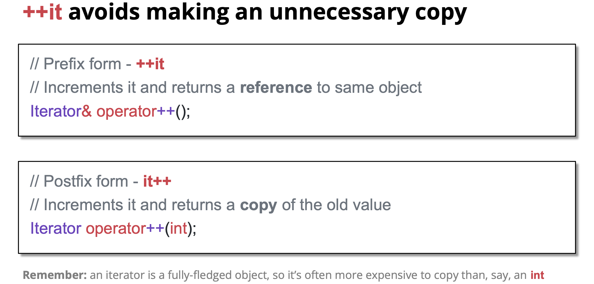

这张图聚焦于**C++迭代器的“前缀递增（++it）”与“后缀递增（it++）”的效率差异**，核心是解释“为什么优先用++it”：

## 1. 核心主题

图的标题直接点明：`++it` 能避免不必要的对象拷贝，比 `it++` 更高效。

## 2. 前缀递增（`++it`）的实现与逻辑

```cpp
// Prefix form - ++it
// 逻辑：先递增迭代器，再返回「原对象的引用」
Iterator& operator++();
```
- 行为：对迭代器本身进行递增操作后，直接返回这个迭代器的**引用**（没有新对象生成）；
- 优势：无拷贝开销，性能更优。

## 3. 后缀递增（`it++`）的实现与逻辑

```cpp
// Postfix form - it++
// 逻辑：先拷贝旧状态，再递增原迭代器，最后返回「旧状态的拷贝」
Iterator operator++(int);
```
- 行为：
  1. 先拷贝当前迭代器的“旧状态”；
  2. 对原迭代器进行递增；
  3. 返回第一步拷贝的旧状态对象；
- 问题：这里的`int`是**占位符**（仅用于区分前缀/后缀重载），但返回的是“迭代器对象的拷贝”——而迭代器是功能完整的对象（不是简单的`int`），拷贝它的成本会更高。

## 4. 底部备注的补充

“迭代器是完整的对象，拷贝它的开销通常比拷贝`int`大得多”——这进一步说明：后缀递增的“拷贝旧状态”操作，会带来不必要的性能浪费。

## 5. Bjarne Stroustrup 的观点

>
> Bjarne Stroustrup：++i 有时会比 i++ 更快，而且永远不会比 i++ 更慢。…… 所以，如果你只是把 i++ 当作一条单独的语句来写（而非作为某个更复杂表达式的一部分），那为什么不直接写成 ++i 呢？这么做对你毫无损失，反而有时能带来好处。

当 “递增” 是单独语句（不是`a = i++`这种需要旧值的表达式）时，直接写`++i`更划算 —— 既不会有任何损失，还能规避`i++`的拷贝开销（结合之前的知识，`i++`需要拷贝旧状态）。