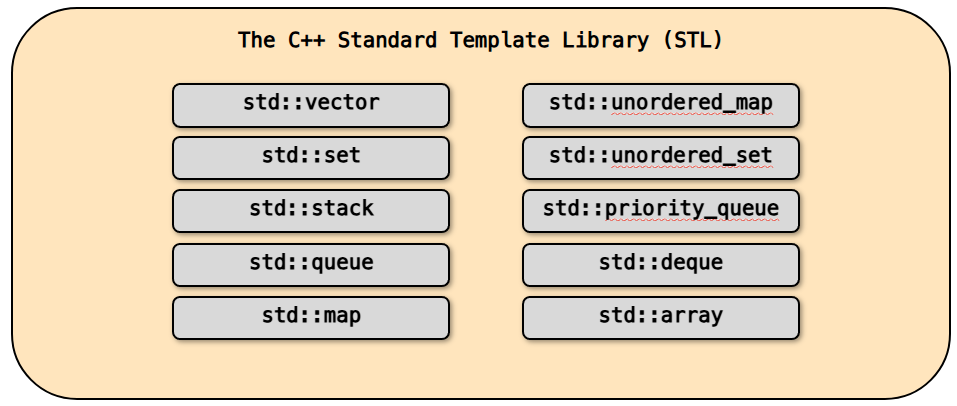
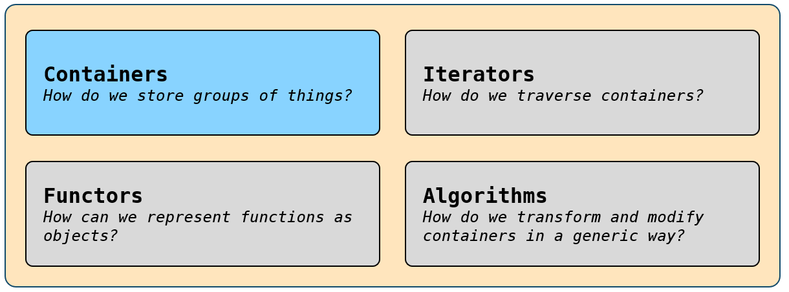
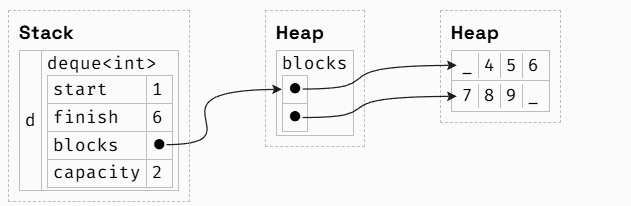
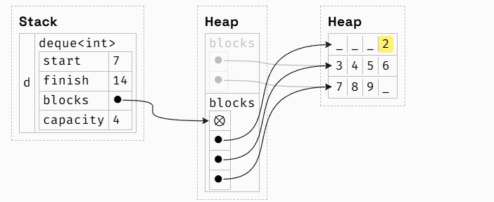
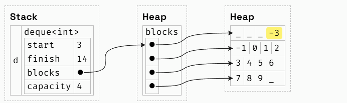
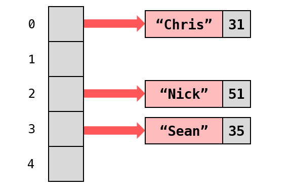
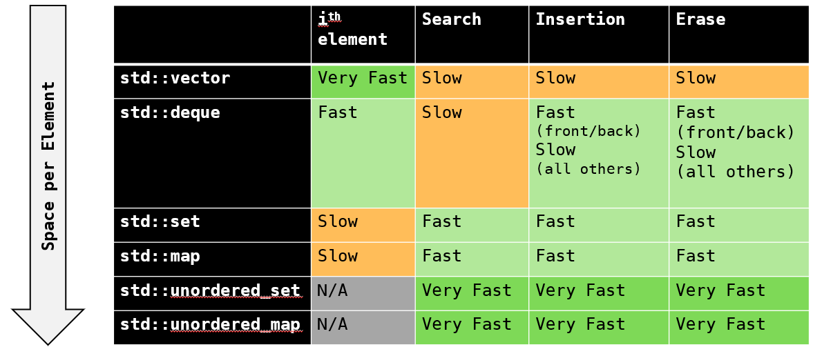
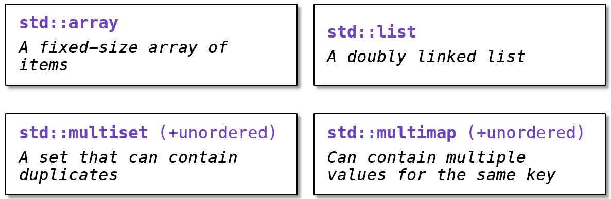

## 容器

1. C++ 标准模板库内置的容器一览



2. 标准模板库的四大组成部分：



> - **Containers（容器）**
>
> 问题：*How do we store groups of things?*（我们如何存储 “一组事物”？）
>
> 解释：容器提供各类**数据结构**，用于组织和存储数据（如 `vector`、`list`、`map` 等），解决 “数据集合的存储形式” 问题。
>
> - **Iterators（迭代器）**
>
> 问题：*How do we traverse containers?*（我们如何遍历容器？）
>
> 解释：迭代器是 “泛型指针”，为不同容器提供**统一的遍历接口**（类似数组下标，但适配所有 STL 容器），屏蔽容器内部结构差异，解决 “容器元素的访问方式” 问题。
>
> - **Functors（函数对象 / 仿函数）**
>
> 问题：*How can we represent functions as objects?*（我们如何将 “函数” 表示为 “对象”？）
>
> 解释：函数对象是**重载了`operator()`的类**，能像函数一样被调用，但因是 “对象”，可携带状态、作为算法的灵活参数，解决 “把‘函数逻辑’封装为‘对象’，供泛型算法使用” 的问题。
>
> - **Algorithms（算法）**
>
> 问题：*How do we transform and modify containers in a generic way?*（我们如何以 “通用方式” 转换 / 修改容器？）
>
> 解释：算法是预定义的**通用操作**（如 `sort`、`find`、`transform` 等），通过 “迭代器” 操作容器（与具体容器类型解耦），实现 “数据结构（容器）和算法分离”，解决 “容器数据的通用处理逻辑” 问题。

3. 顺序容器存储元素的线性序列，比如 `std::vector`。从概念上讲，它们等同于其他语言中的列表：例如 Python 中的 list 或 Java 中的 ArrayList。

```c++
for (size_t i = 0; i < vec.size(); i++) {
	std::cout << vec[i] << " ";
}

// 技巧1：尽可能使用基于范围的for循环 
for (auto elem : vec) {
	std::cout << elem << " ";
}

std::vector<MassiveType> vec { ... };
for (auto elem : vec) ...

// 技巧2：尽可能使用`const auto&` 
// 能避免对每个元素进行可能代价高昂的拷贝操作。
for (const auto& elem : v)

//（这两条）适用于所有可迭代的容器，而不仅仅是`std::vector`
```

**注1**：下标运算符（`operator[]`）不执行边界检查

```c++
std::vector<int> vec{5, 6};				// {5, 6}
vec[1] = 3; 							// {5, 3}
vec[2] = 4; 							// undefined behavior
vec.at(2) = 4; 						 	// Runtime error

// at() 是 std::vector 提供的另一个元素访问方法，其设计目标是安全访问元素，因此会主动进行边界检查。
// 当传入的索引（2）超出有效范围时，at()会主动检测到越界，并抛出一个 std::out_of_range 异常。
// 如果这个异常没有被 try-catch 捕获，程序就会因 “未处理的异常” 而终止，表现为 “运行时错误”。
// 这种行为是完全定义明确的：
// 错误会被显式触发，便于调试；
// 不会默默修改无关内存，避免了潜在的隐蔽错误。

// 之所以这样设计，是因为 v[i] 是一种极为常用的操作。假设我们编写的代码正确，就绝不会尝试访问越界元素。
// 对下标 i 进行边界检查会带来微小但不必要的性能损耗（performance penalty），这在对性能敏感的应用中是不可接受的。
// 不过，若我们需要额外的安心保障，也可以选择启用边界检查 —— 只需使用在其他方面功能等价的 v.at(i) 即可。
```

**注2**：`std::vector` 没有 `push_front` 函数（如果硬要实现，效率会很低），意味着你无法直接在向量开头插入元素，因为效率很低！

```c++
void receivePrice(vector<double>& prices, double price) 
{
	prices.push_front(price);	// 不存在此函数！
	if (prices.size() > 10000)
		prices.pop_back(); 		// Remove last price
								// so we don't exceed 10k
}

// 假设自己实现 push_front，你可以看到会移动很多元素，效率低下
void std::vector<T>::push_front(const T& value) {
  resize(size() + 1); 
  for (size_t i = size() - 1; i > 0; --i) 
    (*this)[i] = (*this)[i - 1];
  (*this)[0] = value; 
}
```

4. C++ 的**零开销原则（Zero-overhead principle）**：

> - **“不为未使用的特性买单”**：如果程序没有使用某些 C++ 特性（如异常、特定模板功能等），编译后的代码不会包含这些未使用特性的额外性能开销（无论是空间还是时间上的）。
> - **“使用的特性与手工最优实现一样高效”**：对于程序中实际使用的 C++ 特性（如标准库容器、算法），其运行效率能达到 “程序员手工编写的合理最优实现” 的水平，不会因为依赖语言或库的抽象能力而产生不必要的性能损失。
>
> 该原则保障了 C++ 在提供高表达力（抽象能力）的同时，仍能保持接近底层的性能效率，是 C++ 兼顾 “开发便捷性” 与 “运行高效性” 的重要设计基石。


5. 在任意时刻，`std::vector` 都会管理**一块连续内存**，其大小足以容纳容器内的所有元素；当需要更多空间时，`std::vector` 会分配一块新内存（并释放旧内存）

```c++
// v的容量为5。在实际情况中，向量的初始容量会取决于编译器。
std::vector<int> v { 1, 2, 3, 4 }; 
v.push_back(5); 

// 向量（v）已耗尽空间，因此它会在堆（heap）上分配一块新内存，拷贝自身的所有元素，然后释放旧的内存块。
// 通常情况下，向量在重新分配（内存）时会将其容量（capacity）翻倍，但具体行为依赖于编译器实现。
v.push_back(6); 
```


5. 双端队列 `std::deque` 是一种双端队列结构，允许在两端高效地进行插入和删除操作

> 双端队列（deque）有着与向量（vector）相同的接口，只是它还允许执行 `push_front`（前端插入）和 `pop_front`（前端弹出）操作

6. 双端队列（deque）是如何实现的：采用数组的数组（即由多个子数组构成）的方式，各个独立的子数组会单独分配内存，如图所示：

   ```c++
   std::deque<int> d { 4, 5, 6, 7, 8, 9 };
   ```

   

   

> 注：deque 要同时支持**前端（`push_front`）和后端（`push_back`）的高效插入**，因此会在 “前端数据块的开头” 和 “后端数据块的末尾” 都预留空闲空间：
>
> - 前端插入时，直接将新元素放入 “前端数据块的空闲位置”（`start` 指针向前移动）；
> - 后端插入时，直接将新元素放入 “后端数据块的空闲位置”（`finish` 指针向后移动）。
>   这种 “对称预留” 让两端插入都能保持 O (1) 时间复杂度（无需移动其他元素）
>
> 从实现细节看，deque 构造时会故意让 `start` 处于 “数据块的中间区域”，而非从 0 开始。例如：
>
> - 有些编译器在初始化 deque 时，会让第一个数据块的**前几个位置空闲**，`start` 指向第一个有效元素的位置（而非块的起始位置）；
> - 当 `push_front` 消耗完前端空闲空间时，deque 会新增一个数据块到 `blocks` 数组的最前端，并调整 `start` 指向新块的空闲位置 —— 整个过程无需移动已有元素，仅需调整指针。
>
> 简言之，`start` 不为 0 是 deque 为了 “双端快速插入” 而做的空间预留设计，牺牲了一点点内存（前端空闲位置），但换来了**两端插入的 O (1) 时间复杂度**（这是 deque 相比 `vector` 的核心优势之一）。

`std::vector<T>` 的问题在于它采用**单一内存分配**：插入点之后的所有元素都必须移动（才能腾出空间）。`std::deque<T>` 则通过将内存分配**拆分为多个固定大小的内存分配块**，解决了这个问题。为了追踪 “已使用区域” 的起止位置，`std::deque<T>` 会使用 `start`（起始）和 `finish`（结束）索引 —— 实际上，这两个值是**迭代器（iterators）**。`blocks` 是一个 “数组的数组”（即存储多个子数组地址的顶层数组），而这里的 `capacity`（容量）指的是这个顶层数组的大小。

```c++
d.push_front(3);
d.push_front(2);
```

当我们尝试在 `deque` 开头插入多个元素，导致双端队列的第一个正在使用的块耗尽空间时，我们就必须分配一个新块。但在此之前，需要在**blocks 数组**中记录指向这个新分配块的指针 —— 而此时 blocks 数组本身也已没有空间。与标准库向量容器（std::vector）在扩容时会将其元素数组容量翻倍的机制类似，双端队列对 blocks 数组也会执行相同逻辑的操作。一旦 blocks 数组完成扩容（复制所有旧指针，随后释放旧的 blocks 数组），就会分配一个新块来存储元素 。



需要注意的是，本例中的 start（起始指针 / 索引）和 finish（结束指针 / 索引）是**相对于 blocks 数组的起始位置**而言的，所以start是7（4+3，指向第8个元素），仿佛该数组已完全填满。但实际上，块是按需分配的，因此本例中的第一个块处于未分配状态，并在 blocks 数组中以空指针形式存储。

再插入几个元素：

```c++
d.push_front(1);
d.push_front(0);
d.push_front(-1);
d.push_front(-3);
```

在插入 1、0 和 - 1 之后，第一个正在使用的块已耗尽空间，因此，为了执行 d.push_front (-3) 操作，会按需分配一个新块来存储 - 3，并将该新块添加到 blocks 数组中。如图：




7. 如果 std::deque<T>在块数组（blocks array）耗尽空间时必须将其扩容一倍，那它为何比 std::vector<T>更高效呢？

> 实际上，deque 中每个块的大小会根据类型 T 有所不同，通常包含数百到数千个元素。这意味着，块数组的扩容操作实际上比 vector 中数据数组的扩容要快数百到数千倍。

8. 尽管 deque 的元素分散在多个分配的内存块中，但它仍像 std::vector<T>一样支持通过索引访问元素。

> 以本例来说，要获取 d [i]，可以先通过索引 (start + i) / 4（使用整数除法）找到 blocks 数组中的对应块，再通过 (start + i) % 4 访问该块内的具体元素。在实际实现中，start 和 finish（指针 / 索引）通常直接存储指向 deque 中首个和最后一个元素的指针，因此具体实现细节可能有所不同，但核心原理是一致的。
>
> 因此，通过索引访问 std::deque<T>的速度比 std::vector<T>稍慢，因为它需要经过两次指针访问（而非一次）才能找到目标元素。虽然 deque 比 vector 功能更强大 —— 它支持 vector 的所有操作，且能做更多 —— 但除非你的使用场景需要高效的前端插入 / 删除操作，否则 vector 仍应作为首选。


6. 关联式容器通过唯一键（unique keys）来组织元素
7. `std::map`（映射容器）将键映射到值，相当于 Python 中的字典，有时也被称为关联数组

> **注**：`std::map<K, V>`（映射容器）存储的是一组 `std::pair<const K, V>`（键值对结构体）


```C++
// 遍历 map
std::map<std::string, int> map;
for (auto kv : map) {
	// kv is a std::pair<const std::string, int>
	std::string key = kv.first;
	int value = kv.second;
}

// 结构化绑定很方便
std::map<std::string, int> map;
for (const auto& [key, value] : map) {
	// key has type const std::string&
	// value has type const int&
}
```

8. 为什么 `std::pair<const K, V>` 中 `K` 用 `const` 修饰？

> `std::map` 是一种**有序关联容器**，其底层通常基于**红黑树**（一种自平衡二叉搜索树）实现。红黑树的结构依赖于键的**有序性**和**唯一性**来维护：
>
> - 树中元素的位置由键的大小关系决定（例如，左子树的键 < 父节点的键 < 右子树的键）；
> - 这种有序性是 `std::map` 能提供高效查找（`O(log n)`）、范围遍历等功能的基础。
>
> 如果允许修改键（即 `K` 不是 `const`），会导致严重问题：
>
> - **破坏树的有序结构**：修改某个键的值后，该元素在红黑树中的位置可能不再符合 “左小右大” 的规则，导致整个树的排序逻辑失效。后续的查找、插入、删除等操作会因为无法准确定位元素而出现错误（例如找不到已存在的元素，或插入重复键）。
> - **违反键的唯一性约束**：`std::map` 要求所有键必须唯一。若修改一个键使其与另一个已存在的键相同，会直接违反这一约束，导致容器状态混乱（标准未定义这种情况的行为，可能引发崩溃或数据错误）。
>
> 因此，将键 `K` 设计为 `const` 是一种 “保护性约束”—— 通过禁止直接修改键，确保 `std::map` 底层结构的有序性和一致性，从而保证其核心功能（如高效查找、有序遍历）能正确工作。
>
> 另：如果需要 “修改” 某个键对应的内容，正确的做法是：先删除原键值对，再插入新的键值对（`erase()` + `insert()`）。

9. `std::map<K, V>` 要求键类型 `K` 具有小于运算符（`operator<`），如果 `K` 没有定义 `operator<`，则需要在声明 `std::map` 时显式指定自定义比较器（如通过第三个模板参数 `Compare`）

```c++
// ✅ OKAY - int has operator<
std::map<int, int> map1; 

// ❌ ERROR - std::ifstream has no operator<
std::map<std::ifstream, int> map2; 
```

10. `std::set`（集合容器）存储一组唯一的元素，可以看作是 “无值版的”`std::map`
11. 你可以把 `unordered_map` 看作是 `map` 的优化版本，它具有与 `map` 相同的接口

> `unordered_map`底层基于哈希表实现，会将键值对分散存储在多个 “桶” 中，通过键的哈希值确定其所在的桶，以此实现高效的查找、插入和删除操作。如图：
>
> 
>
> 添加键/值对时，我们会将键传入哈希函数。哈希值对桶的数量取模后，即确定该键值对所属的桶编号。

12. `std::unordered_map<K, V>`（无序映射容器）要求键类型 `K` 具备一个哈希函数以及（键的）相等性判断（机制）

```c++
// ✅ OKAY - int is hashable
std::unordered_map<int, int> map1;

// ❌ ERROR - std::ifstream is not hashable
std::unordered_map<std::ifstream, int> map2; 

// 注：多数基本数据类型（如 int、double、std::string）默认情况下是可哈希的（hashable）
```

13. 为什么使用 std::unordered_map？

> - 负载因子（Load factor）：每个桶（bucket）中元素的平均数量。
> - std::unordered_map 通过保持较小的负载因子，实现了极快的查找（操作）。
> - 若负载因子变得过大（默认超过 1.0 时），就会进行重新哈希（rehash）。
>
> **注**：“重新哈希（rehash）” 是 std::unordered_map 维护高效性能的关键机制 —— 当负载因子超标时，容器会自动增加桶的数量（通常变为原来的 2 倍左右），并将所有现有元素重新计算哈希值、分配到新的桶中，以此降低负载因子，避免单个桶中元素过多导致查找效率下降。

14. 有趣的 C++ 小知识：`max_load_factor`（最大负载因子），你可以在执行重新哈希操作前，控制（`unordered_map`的）最大负载因子

```c++
std::unordered_map<std::string, int> map;

double lf = map.load_factor(); 	// Get current load factor
map.max_load_factor(2.0); 		// Set the max load factor

// Now the map will not rehash until load factor exceeds 2.0
// You should almost never need to do this, 
// but it’s a fun fact (good for parties!)
```

15. `std::unordered_set`（无序集合容器）是没有值的 `std::unordered_map`（无序映射容器）
16. 何时使用 unordered_map 与 map？

> - unordered_map 通常比 map 更快。
> - 但它会占用更多内存（可类比为 “整齐的车库” 与 “杂乱的车库”：map 像整齐的车库，内存利用规整；unordered_map 像杂乱的车库，需额外空间存储 “桶” 及处理哈希碰撞，内存消耗更大）。
> - 若你的键类型不具备全序性（即未定义 operator< 运算符），就使用 unordered_map！
> - 若你必须在两者中选一个，unordered_map 是稳妥的选择。

17. 总结：



其它容器：



